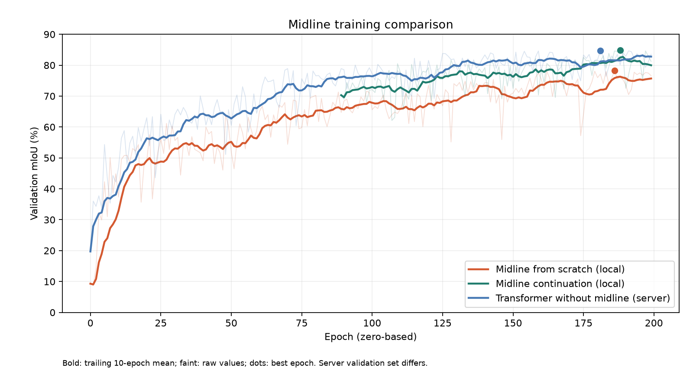

# Midline-from-scratch training comparison — 2026-09-20

Run: `Patch_Seg_17class_gateOn_color_mosaic_tuned_hsv_transformer_midlineseed_scratch_200ep_20260919_102500`

Completed successfully: 200 epochs (0–199), confirmed by TensorBoard and the console completion message. Random initialization, early-global transformer, 17 classes, 30% midline-seeded training patches, 70% scan-sweep training patches (with fallback when incisors are missing). Validation remains pure scan-sweep.

## New run metrics

| Metric | Best-mIoU epoch (186) | Final epoch (199) |
|---|---:|---:|
| Validation mIoU | 78.29% | 76.61% |
| Validation accuracy | 92.78% | 92.25% |
| Training mIoU | 73.07% | 73.75% |
| Training accuracy | 90.74% | 91.11% |
| Validation focal loss | 0.02165 | 0.02161 |
| Training focal loss | 0.02898 | 0.02385 |

## Selected comparisons

| Model | Best validation mIoU | Final validation mIoU | Mean of final 20 epochs | Accuracy at best mIoU |
|---|---:|---:|---:|---:|
| Midline from scratch (local) | 78.29% | 76.61% | 75.85% | 92.78% |
| Midline continuation (local) | 84.78% | 81.22% | 81.34% | 94.29% |
| Transformer, no midline (server) | 84.72% | 83.57% | 82.29% | 95.13% |
| Early + late transformer (server) | 84.00% | 81.69% | 81.50% | 94.72% |
| Dilated, gating off (server) | 83.96% | 82.46% | 81.01% | 94.68% |
| Dilated HSV baseline (server) | 82.92% | 71.62% | 79.30% | 94.40% |

The new run is 6.49 percentage points below the prior midline continuation at best mIoU, and 5.49 points below its final-20-epoch mean. This is a sustained gap, not just an unlucky final checkpoint. The existing midline continuation remains the stronger choice on the recorded scan-sweep validation metric.

## Interpretation and limitations

- mIoU is macro-averaged across 17 classes; accuracy is the overall multiclass accuracy logged by the model. These are training-time validation results, not an independent test-set evaluation.
- The local new and continuation runs use 1,200 train / 600 validation batches per epoch. The historical server transformer log shows 942 / 483. Server values are historical reference points, not a controlled same-data comparison. Dataset code silently excludes absent cached arches; exact historical dataset identities were not saved in the run metadata inspected.
- Validation disables midline-seeded sampling. These metrics do not establish whether the new model improved tiny central-incisor/midline patches. That requires a common held-out midline evaluation and per-class IoU/confusion for teeth 8 and 9; those metrics were not logged.
- A single run does not isolate the cause of the regression. Possible factors include replacing scan-sweep examples with midline examples from the beginning and the changed automatically estimated class weights. Saved focal-loss alpha weights differ between new and continuation checkpoints, so lower absolute focal loss is not evidence that the new model is superior.
- Training mIoU is also lower for the fresh run. The logged metrics alone do not show a simple high-training-score/low-validation-score overfitting pattern.
- The continuation TensorBoard directory contains epochs 89–199 (111 entries), despite the old launcher comments describing a start after epoch 100. Its final-20 average uses epochs 180–199, so that earlier-history mismatch does not affect the comparison above.

## Checkpoints

Best new checkpoint: [best-epoch=186-val_miou=0.7829.ckpt](/home/hesy-tech/MAA/IO_Scanner-Dataset_Models/Models/dilated_tooth_seg_net/checkpoints/patch_dilated_tooth_seg_net/Patch_Seg_17class_gateOn_color_mosaic_tuned_hsv_transformer_midlineseed_scratch_200ep_20260919_102500/best-epoch=186-val_miou=0.7829.ckpt)

Checkpoint payload inspection confirms that the new best checkpoint AND `last.ckpt` both contain epoch 186 / global step 224400. TensorBoard and the console confirm training actually reached epoch 199, but `last.ckpt` is not the final epoch state. The prior midline continuation has the same issue: both saved files contain epoch 188. No checkpoint or training code was changed in this analysis.

## Sources

Values were extracted directly from the TensorBoard event files in `logs/tensorboard/patch_dilated_tooth_seg_net/`, checked against console completion logs and saved checkpoint metadata. `metrics.json` preserves the extracted scalar histories for all local run directories.

